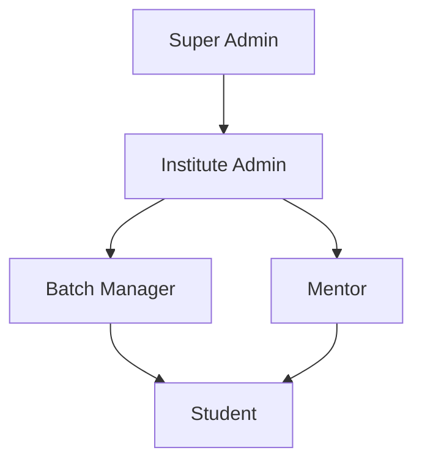

# Platform Organization & Access Control Architecture

This document details the roles hierarchy, security gates, data isolation model, and user access matrix implemented across the DMX Academy platform.

---

## 👥 1. User Roles & Hierarchy

The platform defines five distinct roles in the `Role` enum to support multi-tenant institute scoping and global content delivery.



### 👑 Super Admin (`ADMIN`)
* **Scope**: Global (Platform-wide).
* **Key Function**: Manages core platform systems, creates global contests, designs coding problems, sets global AI configurations, and provisions new institutes and institute admins.

### 🏢 Institute Admin (`INSTITUTE_ADMIN`)
* **Scope**: Institute-bound.
* **Key Function**: Manages the local institute infrastructure, creates and assigns Batches/Cohorts, registers mentors, registers students, and creates institute-scoped contests.

### 👥 Batch Manager (`BATCH_MANAGER`)
* **Scope**: Institute-bound.
* **Key Function**: Coordinates operations for specific target cohorts/batches, oversees student progress, uploads custom prep materials, and helps coordinate live instruction sessions.

### 🎓 Mentor (`MENTOR`)
* **Scope**: Institute-bound.
* **Key Function**: Hosts interactive live classes, generates practice questions from uploaded PDFs, provides feedback on student performance, and sets programming contests.

### 🧑‍🎓 Student (`USER`)
* **Scope**: Global or Institute-bound.
* **Key Function**: Attends classes, completes practice problems, competes in contests, and participates in AI-driven Viva voice reviews.

---

## 🔒 2. Data Scoping & Multi-Tenancy Isolation

Data isolation is built directly into the database layers (`schema.prisma`) using the `instituteId` field:

```
                  ┌──────────────────────────────┐
                  │          Database            │
                  └──────────────┬───────────────┘
                                 │
                  ┌──────────────┴───────────────┐
                  ▼                              ▼
      [Global Asset Pool]              [Institute-Scoped Asset]
     (instituteId: NULL)               (instituteId: 101)
     - Visible to All                  - Visible ONLY to Inst 101
     - Modifiable by Super Admin only  - Modifiable by Inst 101 Staff
```

### 🌍 Global Scope (`instituteId: null`)
* Asset examples: Global Problems, Global Contests, Global Study Materials, Global Question Bank.
* These assets are created by the Super Admin to provide standard core curricula and public practice materials available to everyone on the platform.

### 🏢 Institute Scope (`instituteId: Int`)
* Asset examples: Private Problems, Target Batch Contests, Cohort Study Materials, Local Viva Questions.
* These assets are bound to a specific institute ID. They are created by institute staff and are completely hidden from all other competitor institutes.

---

## ⚙️ 3. Feature Access Matrix

The following matrix describes what each role can do across the different platform features.

| Feature Area | Super Admin (`ADMIN`) | Institute Admin (`INSTITUTE_ADMIN`) | Batch Manager (`BATCH_MANAGER`) | Mentor (`MENTOR`) | Global Student (`USER`) | Institute Student (`USER`) |
| :--- | :--- | :--- | :--- | :--- | :--- | :--- |
| **AI Viva Settings** | 🛠️ Full Control (Read/Write) | ❌ Denied | ❌ Denied | ❌ Denied | ❌ Denied | ❌ Denied |
| **Global Problems** | 🛠️ Full Control (Read/Write) | 👁️ Read / Link only | 👁️ Read / Link only | 👁️ Read / Link only | 👁️ Read/Attempt | 👁️ Read/Attempt |
| **Institute Problems** | ❌ Denied | 🛠️ Full Control | 🛠️ Full Control | 🛠️ Full Control | ❌ Denied | 👁️ Read/Attempt (Own Inst) |
| **Global Contests** | 🛠️ Full Control (Read/Write) | 👁️ Read only | 👁️ Read only | 👁️ Read only | 🏆 Compete | 🏆 Compete |
| **Institute Contests** | ❌ Denied | 🛠️ Full Control | 🛠️ Full Control | 🛠️ Full Control | ❌ Denied | 🏆 Compete (Own Inst) |
| **Study Materials** | 🛠️ Global Materials | 🛠️ Local (Full) + 👁️ Global (Read/Use) | 🛠️ Local (Full) + 👁️ Global (Read/Use) | 🛠️ Local (Full) + 👁️ Global (Read/Use) | ❌ Denied (Staff Only) | ❌ Denied (Staff Only) |
| **Question Bank** | 🛠️ Global Bank | 🛠️ Local (Full) + 👁️ Global (Read/Use) | 🛠️ Local (Full) + 👁️ Global (Read/Use) | 🛠️ Local (Full) + 👁️ Global (Read/Use) | ❌ Denied (Staff Only) | ❌ Denied (Staff Only) |
| **AI Viva Practice** | ❌ Denied | ❌ Denied | ❌ Denied | ❌ Denied | 🎯 Take Session (Global Bank) | 🎯 Take Session (Global + Local Bank) |
| **Live Kit Streaming** | 🎥 Host global/scoped streams | 🎥 Host streams in their inst | 🎥 Host streams in their inst | 🎥 Host streams in their inst | ❌ Denied | 📺 Join stream (Own Batch) |

---

## 🎯 4. Detailed Flow of Core Modules

### 💻 Coding Problems & Contests
1. **Adding Problems**: When an Institute Admin/Mentor adds a problem, it automatically locks to their `instituteId`. Super Admin's problems are tagged `null` (Global).
2. **Display Switcher**: Institute staff see two tabs: **"Your Institute"** and **"Global"**. Global tab actions hide edit/delete buttons for non-super-admins.
3. **Contest Linking**: Institute staff can link both Global and Institute problems to contests, but they can only publish target contests to cohorts belonging to their own institute.

### 🎙️ AI Viva Question Pools
1. **Generation**: Mentors generate questions by uploading PDF study materials. If uploaded by a mentor, the document and all approved questions generated from it inherit the mentor's `instituteId`.
2. **Student Session Start**: When a student starts an AI Viva:
   * If **Institute Student**, the backend loads questions matching:
     $$\text{where} = \{ \text{subject: chosen}, \text{OR: } [ \{\text{instituteId: null}\}, \{\text{instituteId: studentInstId}\} ] \}$$
   * If **Global Student**, the backend loads questions matching:
     $$\text{where} = \{ \text{subject: chosen}, \text{instituteId: null} \}$$
